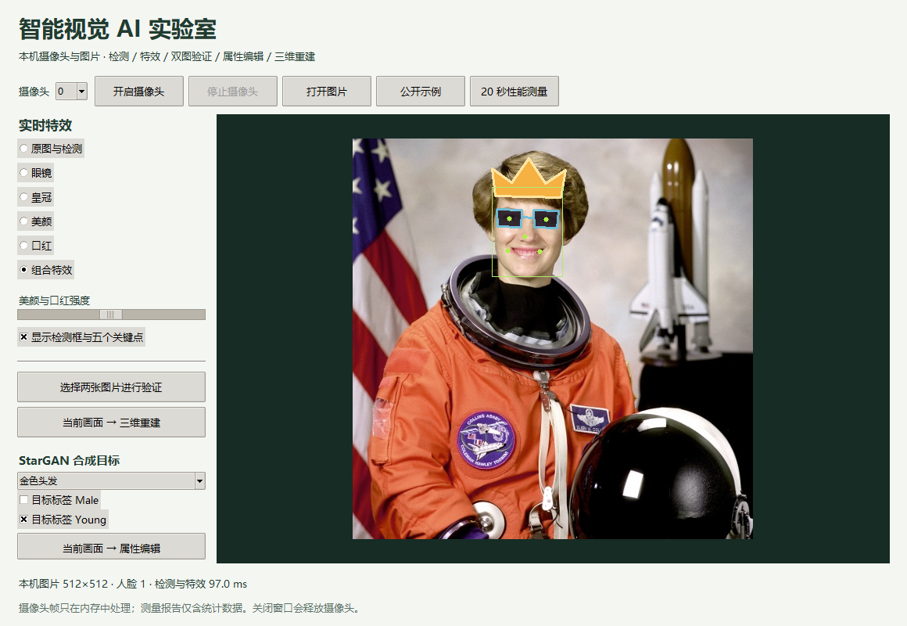
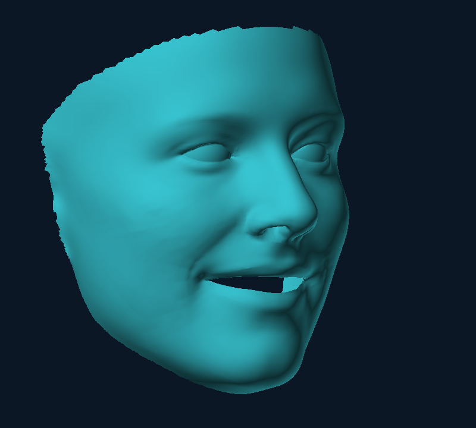

# 本地桌面程序使用与代码教程

本教程介绍最终交付的原生桌面前端。它使用 Python 自带的 Tkinter 创建窗口，用 OpenCV 直接读取这台电脑的摄像头，并在本机调用检测、识别和特效模型。启动桌面程序不需要浏览器，也不启动 HTTP 服务。已有网页版本保留为辅助实验，网页的测试数字与桌面程序分别记录。

你可以把它理解成三个合作的部分：摄像头提供图像，算法把图像变成结果，窗口把结果显示出来。学会使用后，再沿着这三个部分阅读代码，比从第一行机械地往下看更容易。



## 1 从桌面启动

本机完整源码保存在桌面的 `智能视觉AI项目_完整源代码` 文件夹。源码目录包含 `desktop.py`、`app.py`、启动脚本、训练评估程序和教程。虚拟环境、数据集和大型权重与源码分开保存；源码副本不意味着把所有第三方软件再复制一遍。

在已经配置好的项目目录，双击 `启动桌面程序.cmd`，或在 PowerShell 执行：

```powershell
powershell -NoProfile -File start.ps1
```

启动脚本检查依赖和应用模型，然后运行 `desktop.py`。如果依赖已准备好，可直接启动，避免每次联网检查：

```powershell
.\.venv\Scripts\python.exe desktop.py
```

第一次从一份干净的源码副本安装，需要可用的 Python 3.12 和网络。Tkinter 来自 Python 安装组件，不能用 `pip install tkinter` 代替安装。项目的基础依赖固定在 `requirements.txt`；三维和 GAN 功能还需要研究依赖及对应模型。

原生三维查看器使用基础依赖中的 `pyglet==2.1.16`，需要可用的 OpenGL 3.3 或更高上下文。本机实际验证为 Intel Arc 130T / OpenGL 4.6，没有更新驱动。主 `.venv`、项目 conda 和独立 XPU 环境的关系与启动方式见[继续实验教程第 7 节](continued-experiments.md#7-把四类运行环境真正弄明白anaconda-安装启动与排错)；以下命令使用主 `.venv`。

```powershell
python -m venv .venv
.\.venv\Scripts\python.exe -m pip install -r requirements.txt
.\.venv\Scripts\python.exe scripts/fetch_models.py
.\.venv\Scripts\python.exe desktop.py
```

三维模型按来源和哈希下载：

```powershell
.\.venv\Scripts\python.exe -m pip install -r requirements-research.txt
.\.venv\Scripts\python.exe scripts/fetch_models.py --with-3d
```

StarGAN 使用真实训练后导出的 `runs/stargan-deploy/generator.onnx`。源码仓库不包含受许可约束的训练数据或大模型文件；模型缺失时属性编辑按钮不可用，程序不会用颜色滤镜冒充神经网络生成结果。具体训练、导出命令见研究教程和模块的 `--help`。

## 2 使用摄像头与图片

1. 初次打开显示公开示例。先选择“原图与检测”，观察绿色矩形与五个点：矩形表示模型找到的人脸位置，五点表示双眼、鼻尖和两个嘴角。
2. 摄像头序号通常从 0 开始。点击“开启摄像头”，程序直接打开本机设备。若有多个设备，可停止后换序号再开启。
3. 选择眼镜、皇冠、美颜、口红或组合特效。调整强度可以观察美颜与口红的变化；眼镜和皇冠由几何位置决定，不使用该强度参数。
4. “显示检测框与五个关键点”只控制可视化。取消勾选后仍然需要检测关键点，特效才能定位。
5. 点击“停止摄像头”会释放设备，窗口保留最后一帧供查看。关闭窗口同样释放设备。选择本机图片会停止摄像头并处理该图片。

程序采用镜像摄像头预览，接近照镜子的操作习惯。镜像后再进行检测，特效坐标始终对应当前显示图像。图片模式保留文件本身的方向。

摄像头打开失败时，依次核对设备序号、Windows 的“相机”隐私设置中桌面应用的访问权限、其他应用是否占用设备以及摄像头是否被硬件开关关闭。程序先尝试 Windows DirectShow，打开失败再尝试 Media Foundation；它不会自动更改系统隐私设置。

窗口未提供自动录像功能。摄像头帧只在内存中处理；性能测量保存的是帧数、耗时和检测人脸数量，不保存用户图像。

## 3 双图验证与生成式编辑

“选择两张图片进行验证”要求一次选择两张各有一张清晰人脸的图片。程序依次检测、对齐、提取 SFace 特征，再计算余弦相似度。演示阈值固定为 0.363，结果用于理解相似度比较，不是经过身份认证系统校准的结论。用同一张图片比较自己，只能检查计算一致性，不能证明识别准确率为 100%。

StarGAN 属性编辑使用当前原始画面，而不是已经画上眼镜的结果图。点击按钮后摄像头暂停，程序取一份内存快照，按人脸框裁剪并缩放到 128×128。输出左侧是输入裁剪，右侧是合成图。模型只编辑裁剪区域，不把结果贴回整幅视频，也不宣称此路径是实时生成视频。

界面中的 `Male`、`Young` 是 CelebA 数据集采用的二元属性名称。这里的勾选框表示用户要求模型生成的方向，不表示软件判断画面中人物的真实身份或属性。黑、金、棕三种发色目标只能选择一种，传入网络的五个值严格依照 checkpoint 的属性顺序。

发色变化不自然、脸部细节模糊或身份特征变化，都可能是生成模型的局限。当前检测框裁剪与 CelebA 对齐规则并不完全相同，背景、姿态和光线也可能超出训练分布。不能仅凭一张“看起来不错”的图宣布模型可靠。

## 4 在原生窗口查看三维人脸

“当前画面 → 三维重建”要求恰好一张清晰人脸。程序把当前图像交给 3DDFA_V2，预测姿态、形状和表情参数，然后计算 38,365 个顶点与 76,073 个三角面。最终桌面程序会打开独立的原生 OpenGL 窗口，绘制全部三角面。这个窗口由 pyglet 创建，不是浏览器，也不经过本机 HTTP 服务。

在三维窗口中按住鼠标左键左右拖动，或按左右方向键，每次旋转 5°；按 Home 回到正面，按 Esc 或窗口关闭按钮退出。三维窗口与主 Tk 窗口使用不同的进程和事件循环；关闭主窗口时也会回收它创建的渲染子进程。默认查看不会保存三维截图。

早期实现为 Tk 中约 9,000 面的 CPU 抽样预览，抽掉的三角面会造成可见孔洞。最终版本已经删除该抽样渲染函数，使用全部索引和 24 位深度缓冲：可以把深度缓冲理解为给每个像素记录“目前最近的表面距离”，从而决定鼻子、脸颊等表面的遮挡关系。若 OpenGL 初始化失败，界面报告错误；没有把未验证的 CPU 回退作为默认功能。

完整网格已经通过两层实测。首先，独立查看器的 GPU 图元查询读回 76,073；转到 35° 后着色器角度读回 `0.6108652353` 弧度，约 43.81% 的像素发生超过 5 灰度的变化，回到 0° 后图像逐像素一致。其次，实际点击桌面三维按钮，确认完整绘制、35° 回执、截图与子进程退出，见 [desktop-integration.json](../reports/desktop-integration.json)。这是实际 GPU 绘制后的回执，不是仅修改界面的角度文字。



OpenGL 负责画出已经计算好的网格，与 PyTorch 的 XPU 训练后端是不同用途。因此主环境使用 CPU 版 PyTorch，并不妨碍 OpenGL 通过现有显卡驱动渲染。报告中 renderer 字符串的“16GB”是共享内存显示，不能解释成独立显存容量。依赖版本及 BSD 许可见 [来源记录](../reports/native-viewer-dependencies.json)。

单张照片无法提供看不见的所有表面。模型借助从训练数据学到的形状先验做统计估计，因此结果没有真实毫米尺度，侧面和遮挡区域也可能不准确。嘴部开口、头顶和后脑不完整属于这个面部模型的范围与拓扑，不是本次抽样遗漏面造成的孔洞；程序没有凭空补成完整头部扫描。本项目没有配对三维真值，完整绘制通过不能替代几何精度评估。

## 5 怎样读懂摄像头性能报告

开启摄像头后点击“20 秒性能测量”。计时范围是读取一帧、检测与特效、传递最新处理结果、创建 Tk 图像并提交给窗口控件。它不包括传感器曝光到驱动交付前的全部图像年龄，也不等于屏幕完成扫描显示的时间。因此报告使用“渲染提交帧率”这一明确口径。

两轮实测均使用 DirectShow 摄像头序号 0、640×480 帧尺寸和组合特效。第一轮历史原始文件保留为 [desktop-camera-first.json](../reports/desktop-camera-first.json)，第二轮为 [desktop-camera.json](../reports/desktop-camera.json)。首轮在完整训练任务同时运行时进行；两轮没有固定同一输入内容和后台负载，不能当受控 A/B 实验。

| 指标 | 第一轮 | 第二轮 | 正确解释 |
|---|---:|---:|---|
| 测量时长 | 20.0601 秒 | 20.0267 秒 | 实际处理与窗口提交的墙上时间 |
| 提交帧数 | 149 | 316 | 窗口实际提交次数，不是驱动宣称的采集帧率 |
| 提交帧率 | 7.4277 FPS | 15.7790 FPS | 各自的提交帧数 ÷ 测量时长 |
| 单帧延迟中位数 | 136.4935 ms | 43.5976 ms | 各自全部样本的中位数 |
| 单帧延迟 P95 | 159.3555 ms | 168.6882 ms | 使用 higher 分位数，不是最大值 |
| 至少检出一张脸 | 149 帧 | 49 帧 | 检测器非空输出，不代表人工确认的准确率 |
| 未检出人脸 | 0 帧 | 267 帧 | 没有非空检测结果，不能据此断定画面中一定无人 |

第二轮约 84.5% 的帧没有检出人脸。检测器仍然运行，但需要人脸定位的特效步骤可以被跳过，总体耗时因而受画面组成影响。为了不让总体中位数掩盖这种差异，按检测器输出分组如下：

| 条件 | 帧数 | 延迟中位数 | 延迟 P95（higher） |
|---|---:|---:|---:|
| 第一轮：至少检出一张脸 | 149 | 136.4935 ms | 159.3555 ms |
| 第一轮：未检出人脸 | 0 | 无样本，不计算 | 无样本，不计算 |
| 第二轮：至少检出一张脸 | 49 | 161.4576 ms | 198.4104 ms |
| 第二轮：未检出人脸 | 267 | 40.5979 ms | 61.0161 ms |

第二轮总体 FPS 更高，但检出脸组的中位延迟没有同步降低，说明不能只看一个总体数字宣布“优化提速”。这里的条件分层是描述性统计；它不是人工真值分组，也不能单独定位后台负载、算法或设备的因果贡献。不能用某组的中位延迟倒数冒充该组完整端到端 FPS，因为这些帧在整个时间线上交错出现。

两份原始报告都保留逐帧数值、测量口径和未保存摄像头图像的标记。独立分析已核对帧数、检出脸帧数、帧率、中位数和 P95，并输出 [首轮复核](../reports/desktop-camera-first-validation.json)、[第二轮复核](../reports/desktop-camera-validation.json)。可重复执行：

```powershell
.\.venv\Scripts\python.exe scripts/analyze_webcam.py --report reports/desktop-camera-first.json
.\.venv\Scripts\python.exe scripts/analyze_webcam.py --report reports/desktop-camera.json
```

这些数值不能证明所有电脑都能达到流畅的实时效果。比较优化方案时，应控制输入尺寸、特效、线程数、设备、画面中的脸以及后台负载；未控制的条件如实记录，不能把不同条件的最好数字拼在一起。完整 OpenGL 接入后的集成检查没有再运行摄像头测量，因此不能把上述两轮数字标成“OpenGL 接入后再次测得”。

程序采用容量为 1 的结果队列：算法比界面快时，旧的已处理帧可以被新结果替换，避免显示长时间积压的旧画面。因此“算法处理次数”与“窗口实际提交帧数”可能不同。报告计算的是后者。

如果测量提前停止、切换图片、关闭窗口，或遇到摄像头读取错误，报告标记 `interrupted` 并记录原因，不能当完整实验使用。实际断流即使发生在第 20 秒之后，也不能仅凭时长足够把错误报告改成 `completed`；该边界有独立回归测试。

## 6 从代码理解窗口与计算怎样分工

`Desktop` 负责窗口控件，只在主线程操作 Tk。`Worker` 是单个后台线程，独占摄像头和 `Vision` 模型。它们通过 `queue.Queue` 交换命令与结果。这个分工有两个目的：耗时的读取和推理不阻塞窗口事件循环；同一个 OpenCV 检测器也不会同时被两个线程修改输入尺寸。

原生 OpenGL 另放在独立进程中，独占自己的窗口、上下文和网格缓冲。父进程通过 Pipe 发送角度与关闭命令，子进程完成绘制后回执；Tk 在已有轮询中接收事件。这个设计分离了两套窗口循环，但不代表所有计算都不消耗 CPU 或界面永远不会受系统负载影响。

可以按以下顺序阅读源码：

| 文件与入口 | 在程序中做什么 | 阅读重点 |
|---|---|---|
| `启动桌面程序.cmd` → `start.ps1` | 检查环境后启动 `desktop.py` | 默认是桌面；只有显式 `-Web` 才启动辅助网页 |
| `desktop.py` → `Desktop.start_camera` | 将开启命令放入队列 | 按钮不会直接在 Tk 主线程里等待相机 |
| `desktop.py` → `Worker.run` | 打开设备、读取图像、调用算法 | `VideoCapture`、`read`、`release` 的生命周期 |
| `app.py` → `Vision.process` | 检测人脸并绘制特效 | 输入、模型、后处理与耗时边界 |
| `desktop.py` → `Desktop.poll/show` | 取最新结果，转换 BGR/RGB 后显示 | OpenCV 与 Pillow 的通道顺序不同 |
| `desktop.py` → `Desktop.process_current` | 暂停相机并对内存快照做 GAN 或三维推理 | 任务编号防止旧任务覆盖新画面 |
| `vision3d/reconstruct.py` → `reconstruct` | 预测参数并计算输入相关三维网格 | 预训练推理与真实几何精度的区别 |
| `vision3d/native_viewer.py` → `start_viewer` | spawn 子进程、完整索引网格、OpenGL 着色器与深度缓冲 | 父子进程通信、真实绘制后的回执、显式截图和退出释放 |
| `vision3d/licenses/pyglet-2.1.16-LICENSE.txt` | 保留依赖的完整上游 BSD 许可 | 项目源码许可与第三方依赖许可分别遵守 |
| `scripts/verify_desktop.py` | 调用实际 Tk 按钮并检查设备释放等行为 | 自动检查与人工视觉检查各自能证明什么 |

任务编号 `token` 像窗口为操作发放的小票。用户已经换到图片时，即使旧摄像头任务稍后返回，窗口也只接收编号匹配的结果，避免旧画面覆盖新选择。它不是身份编号，也不会识别画面中的人。

完整原始代码及每个函数的行号在 `code-compendium.md` 和对应 HTML 中。代码汇编由文件自动生成，并附 SHA256；应运行原始 `.py` 文件，不需要从 PDF 里手工重新拼接代码。

## 7 已执行的检查与练习

当前默认推荐用不打开摄像头的集成检查，验证真实 Tk 按钮、六种效果、同图验证、本地 StarGAN 和完整 OpenGL 网格：

```powershell
.\.venv\Scripts\python.exe desktop.py --self-test-no-camera
```

最终[集成报告](../reports/desktop-integration.json)验证六效果、同图比较、StarGAN与桌面按钮启动的原生GL，确认76,073面、35°回执及子进程正常退出。此轮未重开摄像头，不能当作第三轮相机性能测量。

真实相机检查用 `desktop.py --self-test`：打开、测20秒、停止、重开、退出释放。它更新 `reports/desktop-verification.json` 和 `reports/desktop-camera.json`，重跑前请另存旧报告。首轮`*-first.json`、第二轮普通文件分别保留；首轮GAN未测、第二轮GAN通过，最终GL由本轮单独验收。

独立GL检查用 `python -m vision3d.native_viewer --self-test --output reports/3d-native`，检查0°/±35°、归零一致及退出。全部保存截图均为NASA公开样图。`tests/test_desktop.py`另模拟断流、单帧推理异常和坏验证图片，确认错误后恢复及状态一致；这些模拟不产生真实相机性能数字。

**练习一：** 为什么不能把 `pipeline_fps = 1000 / pipeline_ms` 当成窗口实际 FPS？

**答案：** `pipeline_ms` 只包括检测与特效，而窗口还需要读取、传递和显示图像，也可能丢弃旧结果。实际提交帧率必须用实际提交帧数除以整段墙上时间计算。

**练习二：** 为什么线程不能直接调用另一个线程创建的 Tk 控件？

**答案：** Tk 的窗口事件循环由创建它的主线程管理。混用线程可能造成间歇错误或退出异常。后台线程只计算并放入队列，主线程按事件循环更新界面，更容易保证生命周期正确。

**练习三：** 停止摄像头后还能看到最后一帧，是否表示相机仍在工作？

**答案：** 不能这样推断。最后一帧可能只是保留在内存里的静态图。应检查 `release()` 已执行、设备能否被重新打开，以及关闭窗口后工作线程是否退出。本项目的实际检查覆盖这些条件。

**练习四：** 第二轮从 7.43 FPS 变成 15.78 FPS，为什么还不能宣布性能翻倍？

**答案：** 第一轮全部帧检出脸，第二轮有 267/316 帧未检出，部分特效步骤没有运行；后台负载也没有固定。应先保证输入和负载可比，再比较同口径指标。第二轮检出脸组的中位延迟为 161.46 ms，不能被总体 43.60 ms 的中位数掩盖。

**练习五：** 主环境是 CPU 版 PyTorch，为什么三维窗口仍能用显卡绘制？

**答案：** PyTorch CPU/XPU 决定张量模型计算的后端；OpenGL 通过图形驱动画网格，是另一条接口。本次先计算好网格，再把全部顶点和三角面交给原生 OpenGL，所以两种设置不矛盾。
